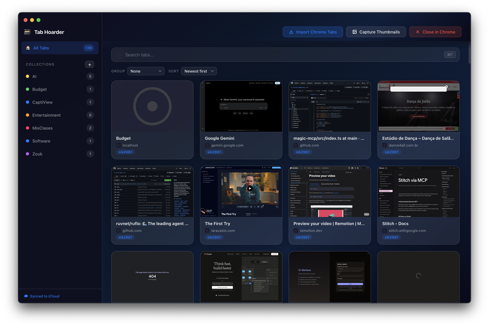
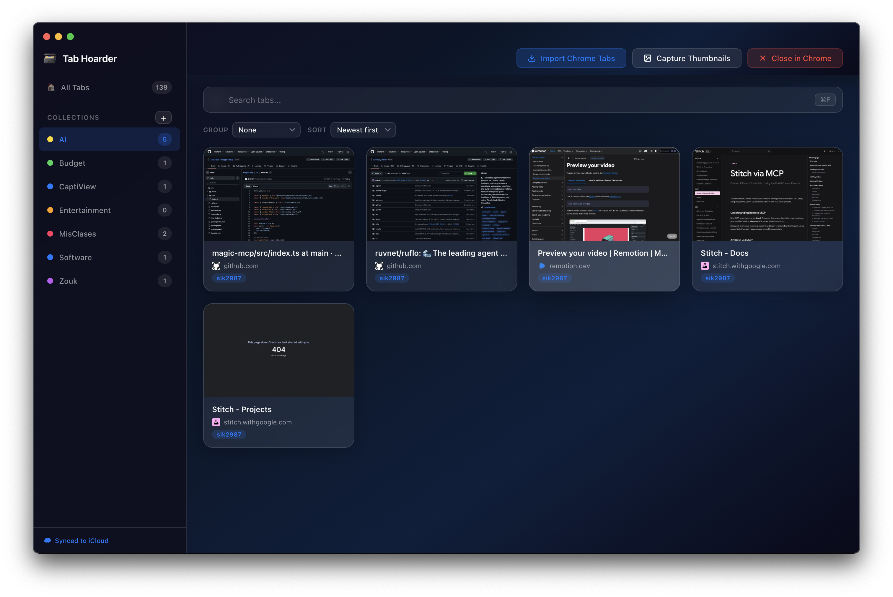
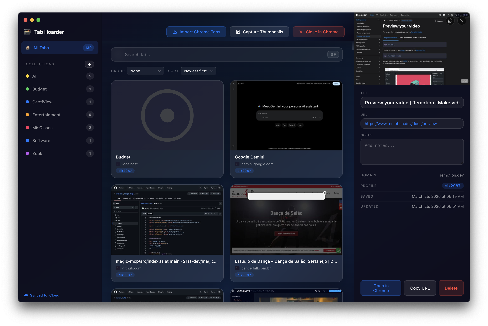
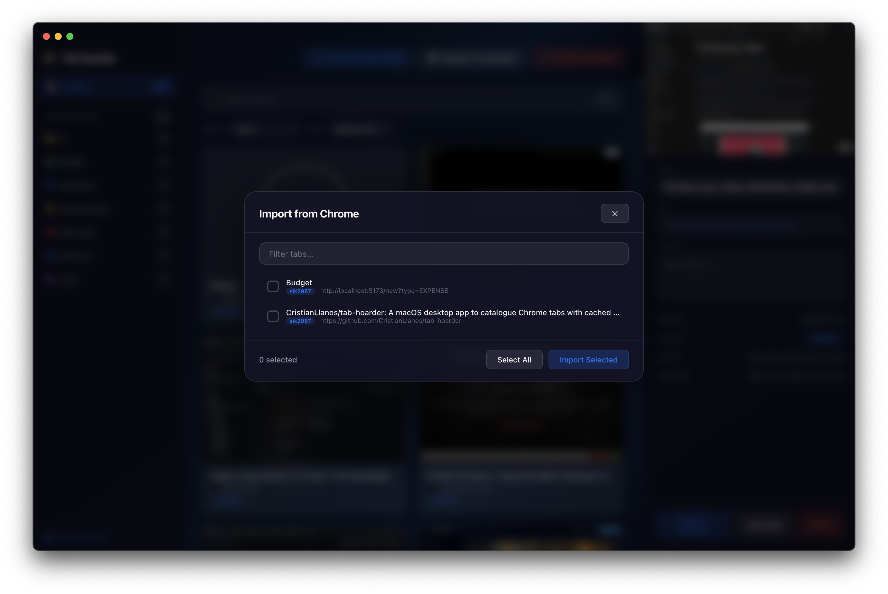

# Tab Hoarder

A macOS desktop app to catalogue your Chrome tabs with cached previews, so you can close them and reclaim memory — without losing track of anything.

Built with Electron, TypeScript, SQLite, and a frosted glass UI inspired by Apple's Liquid Glass design.



## Why?

If you're the kind of person who has 100+ Chrome tabs open across multiple profiles, you know the pain: Chrome eats your RAM, your laptop fans spin up, and you're afraid to close anything because you might need it later.

Tab Hoarder solves this by:

1. **Importing** all your open Chrome tabs (with one click)
2. **Cataloguing** them with titles, thumbnails, favicons, and metadata
3. **Closing** them in Chrome to free up memory
4. **Reopening** any tab instantly — in the correct Chrome profile

Your tabs are safely stored in a local SQLite database, backed up to iCloud automatically.

## Features

### Chrome Integration
- **Import tabs** from all open Chrome windows and profiles via AppleScript
- **Profile-aware**: each tab remembers which Chrome profile it came from
- **Open in correct profile**: clicking a tab opens it in the right Chrome profile
- **Close tabs in Chrome**: bulk-close imported tabs to free memory

### Organization
- **Collections**: create color-coded groups to organize tabs (drag & drop supported)
- **Smart grouping**: group tabs by Category, Related Sites, Time Period, Profile, Collection, or Domain
- **Sorting**: sort by date, title, or domain
- **Full-text search**: instant search across titles, URLs, and domains (powered by SQLite FTS5)

### Visual Previews
- **Thumbnail capture**: automated screenshots of each page, cached locally as JPEGs
- **Favicon caching**: favicons downloaded and cached locally — no repeated network requests
- **Fallback icons**: graceful defaults when thumbnails or favicons fail

### Detail Panel
- **Slide-out sidebar**: click a tab's info area to inspect all metadata
- **Editable fields**: rename titles, edit URLs, add notes
- **Auto-refresh thumbnails**: changing a URL automatically recaptures the screenshot

### Data & Sync
- **SQLite database**: fast, reliable, with WAL mode and full-text search
- **iCloud sync**: all data (database, thumbnails, favicons) stored in iCloud Drive automatically
- **Offline-first**: everything works without an internet connection
- **Graceful migration**: existing local data is automatically migrated to iCloud on first launch

### UI
- **Liquid Glass design**: frosted glass panels, blur effects, smooth animations
- **Native macOS feel**: hidden titlebar with traffic lights, window vibrancy
- **Dark theme**: deep blue gradient background
- **Responsive grid**: cards adapt to window size
- **Keyboard shortcuts**: `Cmd+F` search, `Cmd+I` import, `Cmd+N` new collection, `Esc` dismiss

## Screenshots

| Card Grid | Detail Panel | Import Dialog |
|-----------|-------------|---------------|
|  |  |  |

## Getting Started

### Prerequisites

- **macOS** (uses AppleScript for Chrome integration and native vibrancy)
- **Node.js** 20+ and npm
- **Google Chrome** (for tab import/export)

### Install & Run

```bash
# Clone the repo
git clone https://github.com/CristianLlanos/tab-hoarder.git
cd tab-hoarder

# Install dependencies
npm install

# Rebuild native modules for Electron
npx @electron/rebuild -f -w better-sqlite3

# Start in development mode
npm run dev
```

### First Launch

1. macOS will ask for **Automation permission** — allow Tab Hoarder to control Google Chrome
2. Click **"Import Chrome Tabs"** to pull in all your open tabs
3. Click **"Capture Thumbnails"** to generate preview screenshots
4. Organize into collections, search, and browse at your leisure
5. When ready, click **"Close in Chrome"** to free your memory

### Build for Production

```bash
npm run build
```

## Tech Stack

| Layer | Technology |
|-------|-----------|
| Framework | Electron 41 |
| Language | TypeScript (strict mode) |
| Build Tool | electron-vite |
| Database | SQLite via better-sqlite3 with FTS5 |
| UI | Vanilla TypeScript + Pure CSS (no framework) |
| Thumbnails | Electron's `capturePage()` API |
| Chrome Integration | AppleScript via `osascript` |
| Sync | iCloud Drive (file-based, automatic) |

## Project Structure

```
src/
├── main/                    # Electron main process
│   ├── index.ts             # App entry, window creation
│   ├── storage.ts           # iCloud/local data directory management
│   ├── database.ts          # SQLite schema, migrations, queries
│   ├── ipc-handlers.ts      # IPC channel registrations
│   ├── chrome-tabs.ts       # AppleScript Chrome integration
│   ├── thumbnail-capture.ts # Off-screen page screenshot queue
│   └── favicon-cache.ts     # Favicon download and caching
├── preload/
│   └── index.ts             # Context bridge (typed API)
├── renderer/                # Frontend
│   ├── index.html
│   ├── index.ts
│   ├── styles/              # Liquid Glass CSS
│   ├── components/          # UI components (vanilla TS)
│   └── services/            # API wrappers
└── shared/
    └── types.ts             # Shared TypeScript types
```

## Data Storage

All data is stored in **iCloud Drive** at:
```
~/Library/Mobile Documents/com~apple~CloudDocs/TabHoarder/
```

Falls back to `~/Library/Application Support/tab-hoarder/` if iCloud is unavailable.

Contains:
- `tab-hoarder.db` — SQLite database (tabs, collections, metadata)
- `thumbnails/` — cached page screenshots (JPEG)
- `favicons/` — cached site favicons (PNG)

## Keyboard Shortcuts

| Shortcut | Action |
|----------|--------|
| `Cmd+F` | Focus search |
| `Cmd+I` | Import Chrome tabs |
| `Cmd+N` | New collection |
| `Esc` | Close detail panel / clear search |

## License

MIT
